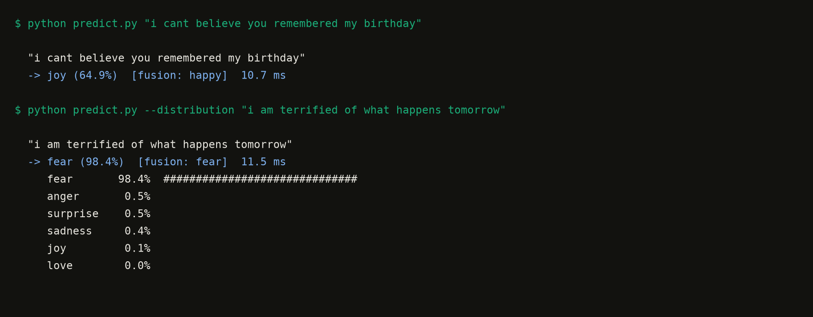
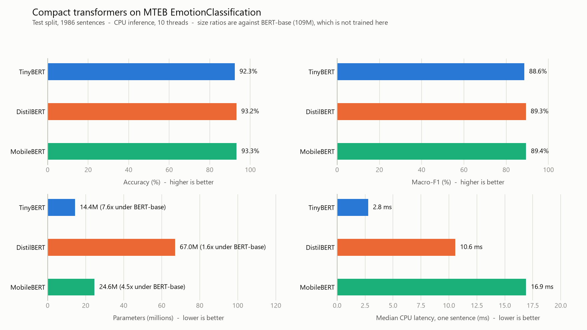
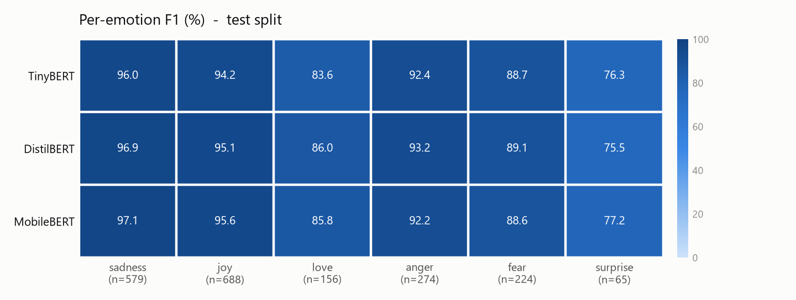
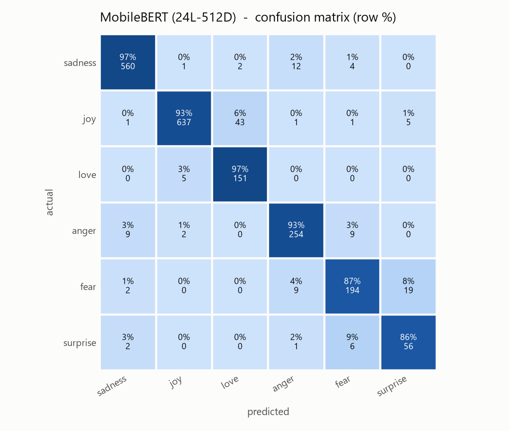

# Text Emotion Module (MTEB)

Contextual emotion understanding from text, without the transformer bloat.

This is the **text modality** of the multimodal emotion recognition system. The
[ViT V2 module](../README.md) reads the face; this module reads what the person
actually says. Both emit a label and a confidence, so the fusion stage can
consume them the same way.

Three compact transformers are fine-tuned and compared on the **MTEB
EmotionClassification** dataset: **TinyBERT**, **DistilBERT** and **MobileBERT**.

## Why these three, and not BERT-base or RoBERTa

The visual module already committed this project to real-time CPU inference with
no dedicated GPU. A text model that needs 110M+ parameters to answer one sentence
does not fit next to it, so BERT-base and RoBERTa are deliberately out of scope.

| Model | Parameters | Status |
|---|---|---|
| BERT-base | 109.5M | **dropped** — too heavy for the CPU target |
| RoBERTa-base | 125M | **dropped** — heavier still |
| DistilBERT | 67.0M | trained — the accuracy reference point |
| MobileBERT | 24.6M | trained — bottleneck architecture |
| TinyBERT (4L-312D) | 14.4M | trained — the deployment candidate |

TinyBERT is distilled specifically to be around **7x smaller and 9x faster** than
BERT-base while retaining roughly 96% of its performance. This module exists to
check whether that trade holds on *this* task rather than to take it on trust.

**It does.** Measured here, TinyBERT is **7.6x smaller and 7.5x faster** than
BERT-base, and reaches **92.30% accuracy / 88.55% macro-F1** — within **0.95
points of accuracy** of the best model tested, at **6x lower latency**. It is the
model this project deploys. Full numbers in [Results](#results).

## Dataset

**MTEB EmotionClassification** — hub id `mteb/emotion`. The splits are used
exactly as MTEB defines them, with no re-shuffling, so the numbers below are
comparable to other work on the benchmark.

| Split | Rows |
|---|---|
| train | 15,956 |
| validation | 1,988 |
| test | 1,986 |

Six classes, and they are heavily imbalanced — which drives two design decisions
in this module:

| Label | Emotion | Train rows |
|---|---|---|
| 0 | sadness | 4,663 |
| 1 | joy | 5,345 |
| 2 | love | 1,297 |
| 3 | anger | 2,152 |
| 4 | fear | 1,931 |
| 5 | surprise | 568 |

1. The loss is **inverse-frequency weighted**. Without it the two largest classes
   (63% of the data) dominate and the rare ones are quietly ignored.
2. The headline metric is **macro-F1**, not accuracy. A model that only ever
   predicted `joy` and `sadness` would still score well on accuracy; macro-F1
   exposes that immediately.

## Setup

```bash
cd text-emotion-module

python -m venv .venv
.venv\Scripts\activate          # Windows
source .venv/bin/activate       # Linux / macOS

pip install -r requirements.txt
```

The dataset and the three pretrained checkpoints download automatically from the
Hugging Face Hub on first run. No manual download step, and no GPU required.

Verify the install:

```bash
python data.py
```

This prints the split sizes, the label distribution, and a few example rows.

## Usage

Classify a sentence:

```bash
python predict.py "i cant believe you remembered my birthday"
```



Every prediction reports four things: the MTEB emotion, the confidence, the
**shared label** the fusion module consumes, and the wall-clock latency of that
single forward pass.

Other modes:

```bash
# probability of every emotion, not just the top one
python predict.py --distribution "i am terrified of what happens tomorrow"

# pick a different fine-tuned model
python predict.py --model distilbert "everything is falling apart"

# run the built-in demo set (see Examples below)
python predict.py --examples

# type sentences in a loop
python predict.py --interactive
```

From Python:

```python
from predict import TextEmotionClassifier

classifier = TextEmotionClassifier("tinybert")

result = classifier.predict("i am so proud of how far we have come")

print(result["label"])         # joy
print(result["confidence"])    # 0.97
print(result["shared_label"])  # happy  -> what the fusion module receives
```

## Reproducing the results

```bash
python train.py --model all     # fine-tune all three
python benchmark.py             # evaluate + measure size and latency
python report.py                # regenerate the figures and tables
```

`train.py` also takes a single model (`--model tinybert`) and
`--max-train-samples N` for a quick smoke test.

Training keeps the epoch with the best **validation** macro-F1 and only then
touches the test split, so the reported test numbers are not selected on.

## Results

All numbers are the MTEB test split (1,986 rows), measured on CPU with 10 threads.
They come from `results/benchmark.json`; the tables are generated from that file
by `report.py` rather than typed in by hand.



| Model | Params | Disk | Accuracy | Macro-F1 | Macro-P | Macro-R | Latency | vs BERT-base |
|---|---|---|---|---|---|---|---|---|
| TinyBERT (4L-312D) | 14.4M | 55 MB | 92.30% | 88.55% | 86.77% | 91.22% | 2.8 ms | 7.6x smaller |
| DistilBERT (6L-768D) | 67.0M | 255 MB | 93.15% | 89.29% | 87.52% | 91.67% | 10.6 ms | 1.6x smaller |
| MobileBERT (24L-512D) | 24.6M | 94 MB | 93.25% | 89.42% | 87.62% | 91.93% | 16.9 ms | 4.5x smaller |

### What this actually shows

**The TinyBERT claim holds, and the speed claim is close.** Measured against an
untrained BERT-base on the same machine, TinyBERT is **7.6x smaller and 7.5x
faster**. The paper's headline is 7.5x smaller and 9.4x faster — the size figure
matches exactly, and the speed figure is lower here because these sentences are
short (mean 22 tokens), which favours the wider model per unit of depth.

**The accuracy cost of going small is under one point.** TinyBERT gives up
**0.95 points of accuracy and 0.87 points of macro-F1** against MobileBERT, the
best model, while being **1.7x smaller and 6.0x faster**. Against DistilBERT it
gives up 0.85 / 0.74 points while being **4.7x smaller and 3.8x faster**.

**Parameter count does not predict CPU latency.** This is the most useful result
for deployment. MobileBERT has **2.7x fewer parameters than DistilBERT but runs
1.6x slower** — 24 sequential layers cannot be parallelised away, whereas
DistilBERT's 6 wide layers map well onto CPU matrix multiplication. For a
latency-bound target, **depth matters more than parameter count**, and a model
selected on size alone would have been the wrong choice.

**Conclusion for this project: TinyBERT.** MobileBERT wins on quality by 0.87
points of macro-F1 and loses on latency by 6x. Since the text module runs
alongside a webcam loop that is already spending its budget on the ViT model,
2.8 ms is worth far more here than 0.87 points.

### Per-emotion F1



| Model | sadness | joy | love | anger | fear | surprise |
|---|---|---|---|---|---|---|
| TinyBERT | 96.0 | 94.2 | 83.6 | 92.4 | 88.7 | 76.3 |
| DistilBERT | 96.9 | 95.1 | 86.0 | 93.2 | 89.1 | 75.5 |
| MobileBERT | 97.1 | 95.6 | 85.8 | 92.2 | 88.6 | 77.2 |
| _test rows_ | 579 | 688 | 156 | 274 | 224 | 65 |

The ranking by emotion is the same for all three models, which suggests the
remaining errors are a property of the **data**, not of model capacity. `surprise`
is worst for every model and has only 65 test rows; `love` is second worst and is
the class most often confused with `joy`.



The confusion matrix confirms it. The two largest error cells are
**joy → love (43 rows)** and **fear → surprise (19 rows)** — both pairs that are
genuinely close in ordinary language. Note that the `joy`/`love` confusion costs
this project nothing, because both map to `happy` in the fusion bridge below.

### Training cost

| Model | Epochs | LR | Train time (CPU) | Throughput |
|---|---|---|---|---|
| TinyBERT | 5 | 5e-05 | 13 min | 722 sentences/s |
| DistilBERT | 3 | 3e-05 | 42 min | 100 sentences/s |
| MobileBERT | 5 | 1e-04 | 47 min | 151 sentences/s |

## Examples

These are the sentences `python predict.py --examples` runs. They are **written
for the demo, not sampled from the dataset** — none of them appear in the train,
validation or test splits, so they show behaviour on unseen phrasing. They are
not an evaluation; the numbers in [Results](#results) come from `benchmark.py`
on the full test split.

| # | Sentence | Intended emotion |
|---|---|---|
| 1 | i feel so empty since she stopped calling me back | sadness |
| 2 | i keep replaying the goodbye and it still hurts | sadness |
| 3 | i cant believe you remembered my birthday this is wonderful | joy |
| 4 | i am so proud of how far we have come together | joy |
| 5 | i adore the way she laughs at her own jokes | love |
| 6 | i feel such tenderness whenever he holds my hand | love |
| 7 | i am furious that they lied to me again | anger |
| 8 | it makes my blood boil when people talk over me | anger |
| 9 | i am terrified of what the results will say tomorrow | fear |
| 10 | i feel a knot in my stomach every time the phone rings | fear |
| 11 | i did not expect a single one of them to show up | surprise |
| 12 | i am stunned that this actually worked on the first try | surprise |

Running them against the TinyBERT checkpoint gives **9 / 12**:

| # | Sentence | Expected | Predicted | Confidence |
|---|---|---|---|---|
| 1 | i feel so empty since she stopped calling me back | sadness | sadness | 98.9% |
| 2 | i keep replaying the goodbye and it still hurts | sadness | sadness | 94.0% |
| 3 | i cant believe you remembered my birthday this is wonderful | joy | joy | 98.6% |
| 4 | i am so proud of how far we have come together | joy | joy | 97.8% |
| 5 | i adore the way she laughs at her own jokes | love | **joy** | 75.0% |
| 6 | i feel such tenderness whenever he holds my hand | love | love | 97.3% |
| 7 | i am furious that they lied to me again | anger | anger | 98.5% |
| 8 | it makes my blood boil when people talk over me | anger | anger | 83.1% |
| 9 | i am terrified of what the results will say tomorrow | fear | fear | 98.4% |
| 10 | i feel a knot in my stomach every time the phone rings | fear | **sadness** | 46.3% |
| 11 | i did not expect a single one of them to show up | surprise | **anger** | 52.5% |
| 12 | i am stunned that this actually worked on the first try | surprise | surprise | 98.0% |

The three misses are the same weaknesses the test-split metrics show, not new ones:

- **#5 `love` → `joy`** is the single most common confusion in the confusion
  matrix. It costs this project nothing: both map to `happy` in the fusion bridge.
- **#10 `fear` → `sadness`** is figurative — "a knot in my stomach" names no
  emotion explicitly. Note the low confidence (46.3%), so the model is signalling
  its own uncertainty rather than being confidently wrong.
- **#11 `surprise` → `anger`** hits the weakest class. `surprise` has 568 training
  rows against `joy`'s 5,345, and scores the lowest F1 for all three models.

Both wrong-and-confident cases are absent: every miss is either low-confidence or
harmless after fusion.

## Integration with the multimodal system

```
                    Multimodal System
                           |
          +----------------+----------------+
          |                |                |
        Image            Audio            Text
          |                |                |
       ViT V2          Audio Model     >> THIS MODULE <<
          |                |                |
   Visual Emotion     Audio Emotion     Text Emotion
          |                |                |
          +----------------+----------------+
                           |
                     Fusion Module
                           |
                     Final Emotion
```

The visual module predicts 7 classes; this module predicts 6. They do not line
up, so `config.py` defines an explicit bridge onto the shared vocabulary the
fusion stage uses:

| Text label (MTEB) | Shared label |
|---|---|
| sadness | sad |
| joy | happy |
| love | happy |
| anger | angry |
| fear | fear |
| surprise | surprise |

Two things worth being explicit about:

- **`love` folds into `happy`.** The visual label set has no affection class, so
  the distinction cannot survive fusion. If the fusion stage ever needs it, the
  text module is the only modality that can supply it.
- **`disgust` and `neutral` are visual-only.** MTEB emotion has no equivalent, so
  the text module never votes for either. The fusion stage must not treat the
  absence of a text vote for `neutral` as evidence against it.

## Project structure

```
text-emotion-module/
│
├── config.py               model registry, label maps, fusion bridge
├── data.py                 MTEB loading, tokenisation, class weights
├── modeling.py             model construction + MobileBERT head fix
├── metrics.py              accuracy / macro-P / macro-R / macro-F1
├── train.py                fine-tuning loop
├── benchmark.py            quality + size + latency comparison
├── predict.py              inference CLI and TextEmotionClassifier
├── report.py               figure and table generation
├── test_text_module.py     test suite
│
├── requirements.txt
├── assets/                 generated figures used by this README
├── results/                benchmark.json, tables.md, train_log.txt
└── checkpoints/            fine-tuned weights (git-ignored)
```

`checkpoints/` is git-ignored — the weights are large and regenerable. The
metrics they produced are committed in `results/benchmark.json`, so the tables
and figures above can be rebuilt without retraining.

## Tests

```bash
python test_text_module.py
```

Or under pytest, if installed:

```bash
pytest test_text_module.py -v
```

The suite covers the label maps and the fusion bridge, the MTEB split shapes, the
dynamic-padding collate function, the class weighting, and the metric definitions
— including a case that asserts macro-F1 actually exposes majority-class collapse.
Tests that need trained weights skip cleanly when `checkpoints/` is empty, so the
suite is useful before training as well as after.

With all three models trained and `benchmark.py` run, the full suite passes:

```
21 passed, 0 failed, 0 skipped
```

Two of these tests exist because they caught real bugs during development:

- `test_majority_class_collapse_is_visible_in_macro_f1` caught `macro_f1` being
  averaged over only the labels *present* in a batch rather than all six, which
  would have flattered any model that never predicted a rare class.
- `test_adapted_head_survives_a_save_load_round_trip` guards the MobileBERT head
  fix described below — without it, `from_pretrained` silently rebuilds a plain
  `Linear` and drops the trained classifier weights.

## Design notes

**Why a plain PyTorch loop instead of `transformers.Trainer`.** The three
architectures differ enough (4 layers vs 24; a bottleneck stack vs a standard
one) that a comparison is only fair if the training procedure is provably
identical. A visible loop makes that checkable.

**Why dynamic padding.** The texts are short — mean 22 word-piece tokens, p99 57,
longest 87. Padding every row to 128 would spend roughly five times more CPU on
padding than on real tokens. Batches are padded to their own longest row instead.

**Why MobileBERT needs a BatchNorm before its classifier.** This one is worth
recording, because the failure is silent and looks like a bad learning rate.

`google/mobilebert-uncased` sets `normalization_type="no_norm"`, so its `NoNorm`
layers apply an elementwise affine transform *without normalising*. Activations
grow through all 24 layers:

```
per-layer abs max:  9.3  20.6  24.5 ... 28.9  792  63227328
```

The backbone is fine — the masked-LM head still completes
`the capital of france is [MASK]` → `paris` — because that head applies its own
LayerNorm. The **pooler does not**, and with `classifier_activation=False` it
hands the raw first-token state straight to the classifier. Two measured
consequences:

1. A freshly initialised classifier produces logits around `1e6`, so training
   starts at a cross-entropy of **6,730,050** instead of `ln(6) = 1.79` and burns
   most of its budget just shrinking the head.
2. That first-token state is dominated by an **input-independent** component.
   Across different sentences the raw vectors have pairwise cosine similarity
   **0.9999** — the part that identifies the sentence is ~1e-4 of the magnitude.

Two obvious fixes do not work:

- `classifier_activation=True` makes the pooler `tanh(dense(h))`, but with a 1e7
  input the tanh saturates and *every* sentence collapses to the same ±1 vector.
- `LayerNorm` centres across the feature dimension, while the offending component
  is constant across **examples**. 408 of the 512 dimensions exceed 1e5, so there
  is no small set of outlier dims to strip.

`BatchNorm1d` centres and scales each dimension across the batch — the axis the
constant component actually lives on. Measured on 64 training rows:

| Pooled representation | Pairwise cosine |
|---|---|
| raw first-token state | 0.9999 |
| after per-dimension centring | 0.0069 |

So MobileBERT alone gets a `BatchNorm1d` in front of its classifier, in
`modeling.py`. Optimiser, schedule, loss, data and seed stay identical across all
three models, and `modeling.py` is the single place that builds a model so
training, benchmarking and inference cannot drift apart.

**Why latency is measured on one sentence.** That is how the module is actually
called — one user utterance at a time, alongside one webcam frame. Batched
throughput is reported separately in `results/benchmark.json`.

## Troubleshooting

**No checkpoint found**

```
FileNotFoundError: No checkpoint at .../checkpoints/tinybert
```

Train it first: `python train.py --model tinybert`

**Dataset download fails**

The first run needs network access to `huggingface.co`. Behind a proxy, set
`HTTPS_PROXY`. Once cached, everything runs offline.

**Symlink warning on Windows**

```
huggingface_hub cache-system uses symlinks by default ...
```

Harmless — the cache falls back to copying files. Silence it with
`set HF_HUB_DISABLE_SYMLINKS_WARNING=1`.

**Predictions look wrong for the emotion you expected**

The six MTEB classes are narrower than everyday emotion vocabulary — there is no
`neutral` and no `disgust`, so a flat or disgusted sentence is forced into one of
the six. Check `--distribution` to see whether the model is genuinely confident or
merely picking the least-bad option.
